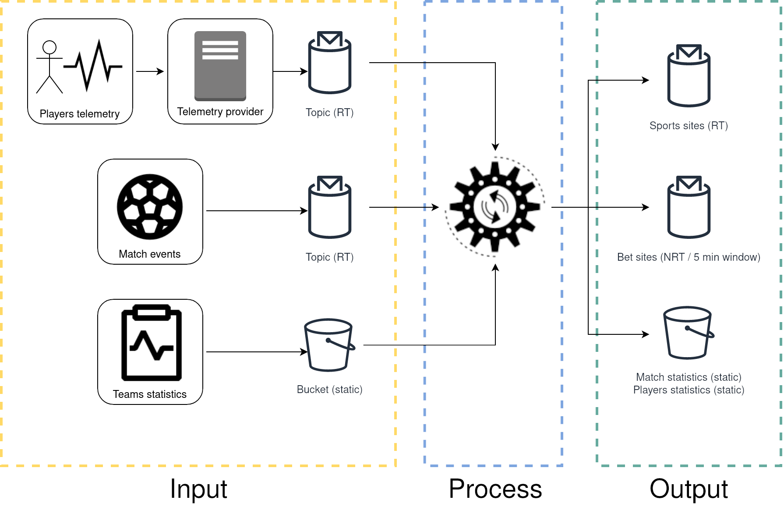

# Architectural case

## Data processing model

I recommend using the "[Beam model](https://www.oreilly.com/radar/the-world-beyond-batch-streaming-101/)" as architecture solution. The main reasons are:

- Handle of batch and stream data for input and output: 
  - Cross data from static and real time sources.
  - Writing to static (like buckets or databases) and real time (like topics) destinations at the same time allow to share the same data in multiples ways.
- Group data in fixed times windows. This make posible to send "bet sites" information every 5 minutes.
- Handling streaming errors gracefully:
  - This process include "player telemetry" from external service, so its more prone to have reliability problems (like late data arrival or mixed order).
  - In case of problems with already processed data, the Beam Model provide to reprocess the data or discard it.
- Only one data-pipe, unlike the "[lambda architecture](https://en.wikipedia.org/wiki/Lambda_architecture)", makes it easier to mantain and less prune to logical problems.
- Exactly-once processing if the [right stack](https://cloud.google.com/blog/products/data-analytics/after-lambda-exactly-once-processing-in-google-cloud-dataflow-part-1) is choosed.

## Software proposals / recomendations

The "Beam model" is widely [promoted by Google](https://cloud.google.com/blog/products/gcp/why-apache-beam-a-google-perspective), but it can be implemented in diferrent platforms.
I recommends 3 platforms, basend on the existing hardware infraestructure:

- Bare-metal servers: For more traditional "server" infraestructure (servers or virtual machines).
- Container native: For Kubernetes clusters.
- Google Cloud Platform: For no infraestructure investment or "pay as you go".

| Type / Platform | Streaming service  | Storage service  | Processing Service  |
|---|---|---|---|
| Bare Metal | Apache Kafka | Apache Hadoop (HDFS) | Apache Beam (process) + Apache Flink (runner) |
| Container native | NATS | MinIO | Akka cluster |
| Google Cloud Platform | PubSub | Input: CloudStorage / Output: BigQuery | DataFlow |
