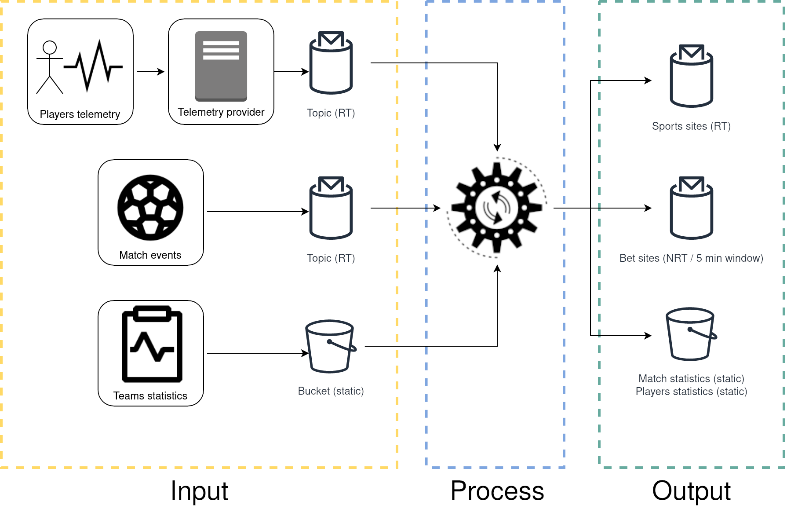

# Architectural case

## Data processing model

I reconnend using the "[Beam model](https://www.oreilly.com/radar/the-world-beyond-batch-streaming-101/)" as architecture solution for the ability to handle late data and reprocess and the simplicity to mantain.

This process include "player telemetry" from external service, so its more prone to have reliability problems (like late data arrival or connectivity issues). The traditional "Lambda" model cant handle this condition and could lead to incorrect data.

## Software proposals / recomendations

| Type / Platform |  |  |  |
|---|---|---|---|
| Open source software | Apache Kafka | Apache Hadoop (HDFS) | Apache Beam (process) + Apache Flink (runner) |
| Container native (free)) | NATS | Kubernetes + MinIO | Kubernetes + Akka cluster |
| Google Cloud Platform | PubSub | Input: CloudStorage / Output: BigQuery | DataFlow |

## Error handling considerations fo

